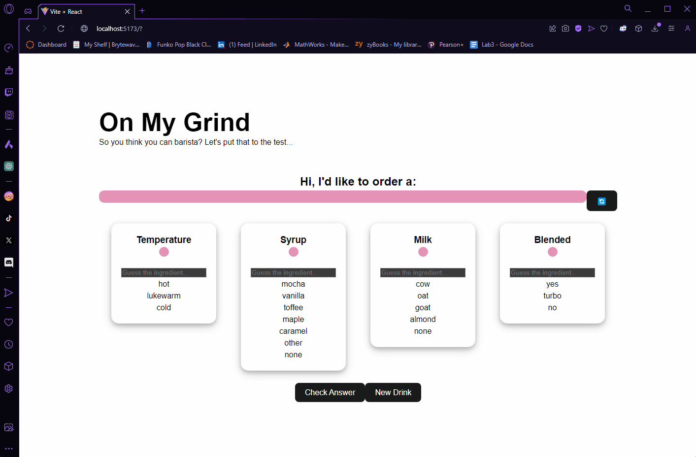

# Barista App

This is a simple web application that allows users to practice making coffee orders by guessing the correct ingredients for various drinks.

## Demo

## Features

- Users can see a random drink order.
- Users can input their guesses for the temperature, syrup, milk, and whether the drink is blended.
- Users can check their answers.
- Validation alerts are provided for incorrect guesses.

